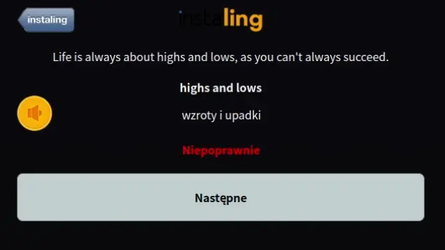

# AutoLing

### Instalacja
Klikasz zielony przycisk na górze strony: 'Kod' -> 'Pobierz ZIP'. Rozpakuj gdzieś w niezmiennej lokalizacji. Następnie w Chrome/Edge/Brave/etc. wchodzisz na stronę `chrome://extensions`, włączasz tryb dewelopera/programisty i klikasz 'załaduj rozpakowaną wtyczkę' czy coś w ten deseń. Obecnie wsparcia dla Firefoxa nie ma.
### Mały disclaimer
InstaLing zabrania używania skryptów i zabrania sobie prawo do nakładania kar okresowo. Jak i czy wykrywają skrypty nie wiem. Jeśli dostaniesz bana przez tę wtyczkę, jest to **twoja odpowiedzialność i twoja wina**.